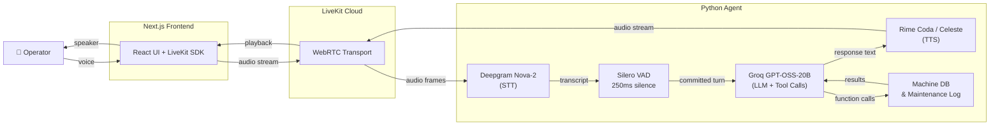

# YieldPoint
**A Rime Hackathon Submission by Team Apex**

YieldPoint is a voice-native intelligent assistant designed for manufacturing production floors. It allows operators and technicians to check machine specifications, retrieve maintenance schedules, and log safety/maintenance events entirely hands-free.

## Voice Native Design
A simple chatbot with a play button does not work on a noisy production floor where operators wear gloves and have their hands full of tools. Voice is absolutely essential to this experience.

### The Hard Voice Problem: Perceived Response Time
We focused on reducing **Perceived Response Time**. By tuning Voice Activity Detection silence (`min_silence_duration: 0.25`, the LiveKit TurnDetector floor) with aggressive turn endpointing (`min_delay: 0.2`) and enabling **Preemptive TTS Generation** (speculative Rime synthesis), we mask TTS latency and target glass-to-glass response times at human-conversational levels (< 500ms). See `RIME_EVIDENCE.md` for acceptance criteria and how to read the agent latency logs.

---

## Technical Architecture

The project is split into a robust Python backend agent and a sleek Next.js WebRTC frontend.

- **Backend (Python)**: Uses the LiveKit Agents SDK. The agent is built on `AgentSession` and orchestrates STT, LLM function calling, and TTS generation. Explicit dispatch name: `floor-tech-local`.
- **Frontend (Next.js)**: A React application utilizing `@livekit/components-react` to handle secure token generation (with `RoomAgentDispatch`), microphone access, and WebRTC streaming directly to the backend. Each Connect creates a unique room so dispatch always applies.



### Third-Party Services
- **Voice Orchestration & Transport**: LiveKit (WebRTC)
- **Speech-to-Text (STT)**: Deepgram (`nova-2`)
- **Language Model (LLM)**: Groq (`openai/gpt-oss-20b`)
- **Text-to-Speech (TTS)**: Rime (primary spoken output)

### Rime Integration Details
- **Model ID**: `coda`
- **Speaker**: `celeste`
- **Language**: English (`eng`)
- **Endpoint**: LiveKit native Rime plugin (`livekit.plugins.rime`), credentials via `RIME_API_KEY`
- **Audio Format**: PCM @ 22050 Hz (`sample_rate=22050`), streamed over WebRTC
- **Transport**: WebRTC (LiveKit)
- **Latency tuning**: `reduce_latency=True`, preemptive TTS enabled

---

## Setup Instructions

### 1. Configuration Hygiene
Copy the `.env.example` file to create your local `.env` files.
```bash
cp .env.example .env
cp .env.example frontend/.env.local
```
Fill in the placeholders with your actual LiveKit, Deepgram, Groq, and Rime API keys. **Never commit live credentials.**

Ensure `NEXT_PUBLIC_LIVEKIT_URL` is set in `frontend/.env.local` (same value as `LIVEKIT_URL`).

### 2. Run the Backend Agent
Ensure you have Python 3.12+ installed.
```bash
pip install -r requirements.txt
python agent.py dev
```
The worker registers as `floor-tech-local` and waits for explicit room dispatch.

### 3. Run the Frontend UI
In a separate terminal, start the Next.js server.
```bash
cd frontend
npm install
npm run dev
```
Open `http://localhost:3000` in your browser and click "Connect to Agent" to begin speaking.

---

## Known Limitations & Failure Behavior
- **Interruptions**: Barge-in flushes the Rime audio buffer and cancels generation. If the operator is still speaking when tools finish, YieldPoint cancels the automatic tool reply so stale results are not spoken. Tool side-effects already applied to the in-memory log are not rolled back.
- **Noisy Environments**: Deepgram's `nova-2` model is highly resilient to background noise, but excessive industrial noise may stretch VAD silence past the 250ms floor and temporarily increase latency.
- **Preemptive miss**: If the operator changes their request in the final moments of an utterance, preemptively synthesized audio is discarded and regenerates (higher latency).
- **Database**: The application currently uses an in-memory mock dictionary (`MACHINE_DB`) for demonstration purposes. If the Python agent restarts, all dynamically logged maintenance events will reset.
- **Dependencies**: If LiveKit, Deepgram, Groq, or Rime is unavailable, the session fails visibly (connect error or agent error logs). There is no silent alternate TTS provider — Rime is the only spoken output path.
